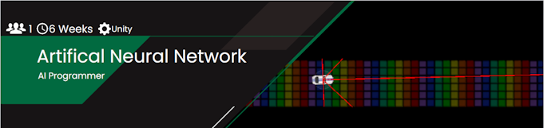
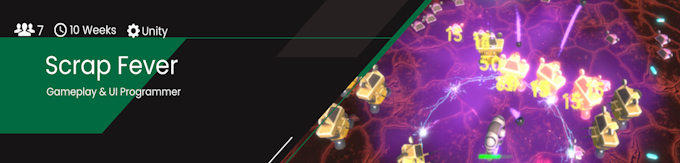
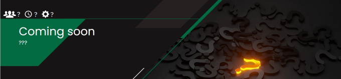
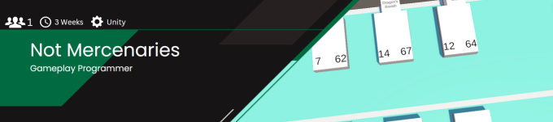
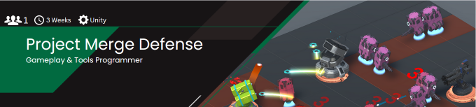

Hi, I'm Bastian, an ongoing game developer that's currently studying Game Engineering at the [S4G School for Games](https://www.school4games.net/).
I've been making games as a hobby since 2019 and am learning professional game programming since 2022. I'm almost ready to put my foot into the door of the wide world of video game studios.
So why not check out what I have been up to recently? You can also find me on [LinkedIn](www.linkedin.com/in/bastian-krüger-648837256).

  
# Major Projects

 Bigger projects that I created together with other developers and/or over a longer period of time.   Click on the Projects to learn more about them.

  
# Side Projects

 Smaller projects that were mostly created for self educational purposes.   Click on the Projects to learn more about them.

<!--  -->

