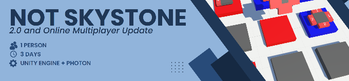

Hi, I'm Bastian, an ongoing game developer that's currently studying Game Engineering at the [S4G School for Games].
Like many of you I love video games. In fact, I enjoy them so much I started created my own. What started as a hobby (which in itself started with a bored friday afternoon in the 9. grade), has now become my profession. 
Of course this doesn't have to mean that I have to give up that hobby, so I continue working side projects. 

Below this introduction you can find a selected overview of some of the projects I worked on. Also feel free to contact me on [Linkedin](www.linkedin.com/in/baskrueger).

  
# Major Projects

 A selection of bigger projects that I created together with other developers and/or over a longer period of time.   Click on the Projects to learn more about them.

  
# Side Projects

 A selection of smaller projects that were mostly created for self educational purposes.   Click on the Projects to learn more about them.

<!--  -->

# Updates

 A selection of bigger updates I did to already existing projects.   Click on the Projects to learn more about them.

