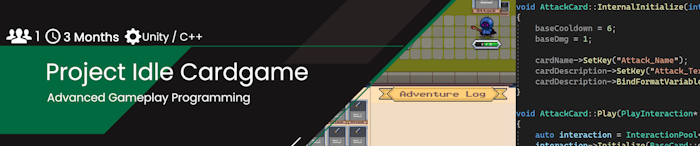

Like many of you I love video games. In fact, I enjoy them so much I started created my own. What started as a hobby (which in itself started with a bored friday afternoon in the 9. grade), has now become my profession. 
Of course this doesn't have to mean that I have to give up that hobby, so I continue developing new projects every now and then.

Feel free to check them out by clicking on the banners below.

  
# Most recent Project

   Click on the Project to learn more about it.

  
# Side Projects
A selection of smaller projects that were mostly created for self educational purposes.   Click on the Projects to learn more about them.

<!--  -->

# Student Projects

 An comprehensive overview of student project that I've been a part of at my time at the S4G - School for Games.   Click on the Projects to learn more about them.

